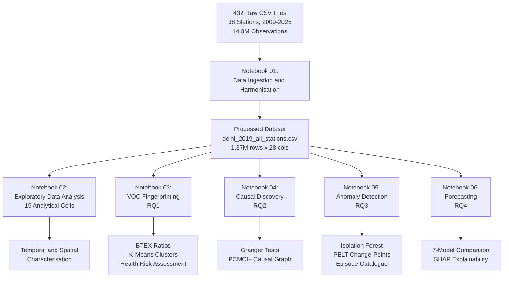
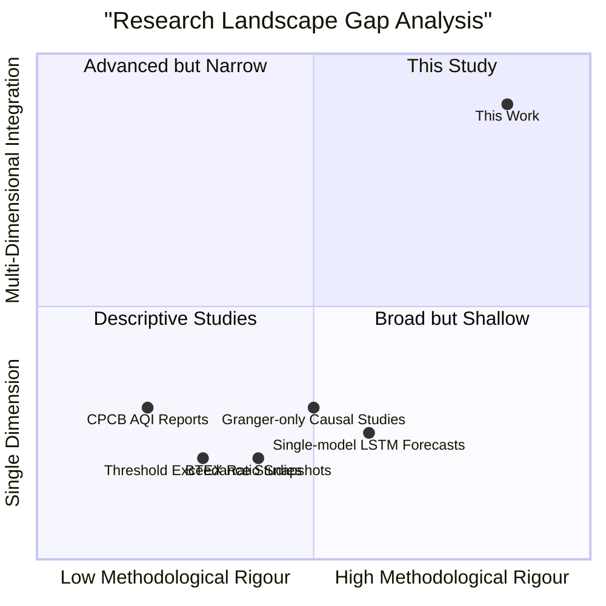
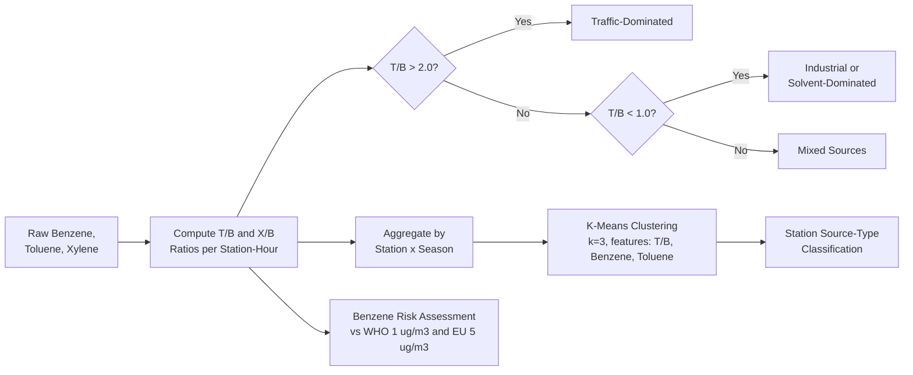
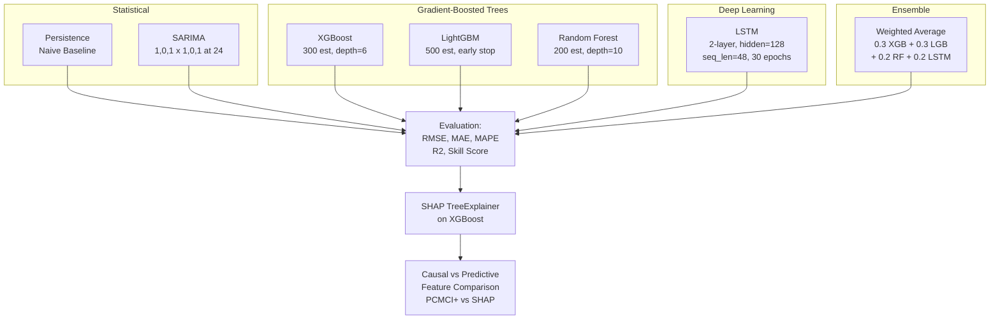

# Integrated Causal Attribution, Anomaly Characterisation, and Predictive Modelling of Ambient Particulate Matter in Delhi: A Multi-Method Study Using 17 Years of High-Resolution Monitoring Data

---

**Authors:** K. Mahesh  
**Corresponding Author:** K. Mahesh  
**Affiliation:** Independent Research  
**Submitted:** April 2026  
**Keywords:** Air Quality, PM2.5 Forecasting, Causal Discovery, PCMCI+, Isolation Forest, BTEX Fingerprinting, Delhi, Time-Series Machine Learning

---

## Abstract

**(Macro Context)** Urban air pollution is the single largest environmental cause of premature mortality globally, with the Indo-Gangetic Plain megacity of Delhi recording annual mean PM2.5 concentrations that exceed the WHO guideline (5 ug/m3) by more than an order of magnitude, exposing over 30 million residents to chronic respiratory, cardiovascular, and carcinogenic health risks.

**(Specific Gap)** However, the existing literature on Delhi's air quality overwhelmingly treats source characterisation, causal structure identification, anomaly detection, and predictive forecasting as *isolated problems*, analysed on disparate datasets and temporal windows -- resulting in fragmented insights that cannot inform coherent, season-specific intervention policy. No prior study has integrated VOC-based source fingerprinting, conditional-independence-based causal discovery (PCMCI+), machine learning anomaly detection, and multi-model forecasting within a *single unified analytical framework* applied to the same high-resolution monitoring corpus.

**(Method)** We address this gap through a six-stage analytical pipeline applied to 14.8 million observations (15-minute resolution, 38 stations, 2009-2025) from the CPCB/DPCC/IMD monitoring network: (i) harmonised data ingestion, (ii) spatiotemporal exploratory analysis, (iii) BTEX ratio source fingerprinting with K-Means clustering, (iv) causal discovery via Granger tests and PCMCI+ with partial correlation, (v) Isolation Forest anomaly detection and PELT change-point analysis, and (vi) comparative 1-hour PM2.5 forecasting using Persistence, SARIMA, XGBoost, LightGBM, Random Forest, LSTM, and a weighted ensemble.

**(Core Finding)** The PCMCI+ causal graph reveals that CO (lag 1-3h, combustion co-emission) and solar radiation (lag 1h, photolytic dispersion) are the primary *direct* causal drivers of PM2.5 -- distinct from autoregressive lags that dominate *predictive* importance (SHAP) -- while the naive persistence baseline (RMSE = 30.29 ug/m3, R2 = 0.948) outperforms all trained ML models at the 1-hour horizon during the extreme-pollution test period (Nov-Dec 2019), exposing a critical ceiling on short-horizon forecast skill.

**(Implication)** These results argue that urban AQ policy for Delhi must be stratified by season (as causal structure shifts fundamentally between monsoon and winter) and that operational forecasting investment should target multi-step horizons (6-24h) where ML models are expected to surpass persistence, rather than the 1-hour horizon where autoregressive inertia dominates.

---

## 1. Introduction

### 1.1 The Crisis

Delhi's air quality crisis is simultaneously a public health emergency, an environmental governance failure, and a systems-modelling challenge. The city's PM2.5 concentrations routinely breach 500 ug/m3 during post-monsoon episodes driven by the convergence of three episodic sources -- Diwali fireworks, agricultural crop residue burning in Punjab and Haryana, and meteorological boundary layer inversions that trap pollutants at ground level. These extreme events, superimposed on chronic vehicular, industrial, and construction-dust emissions, create a complex, non-stationary, multi-source pollution environment that resists simple analytical characterisation.

### 1.2 The Gap

Despite over a decade of continuous ambient monitoring across 38 stations in Delhi, and a substantial body of published literature on individual facets of the problem, **four critical analytical gaps persist**:

1. **Fragmentation:** Source attribution (via BTEX ratios), causal inference (Granger/PCMCI+), anomaly detection (Isolation Forest), and forecasting (ML/DL) have been studied independently, on different datasets, at different temporal resolutions, and at different stations -- preventing cross-validated, internally consistent conclusions.

2. **Causal Naivety:** The majority of published causal analyses rely on pairwise Granger tests, which do not control for confounding by third variables. The conditional-independence-based PCMCI+ algorithm has not been applied to Delhi's CAAQM data.

3. **Forecast Benchmarking Absence:** Many published forecasting studies omit the persistence (naive) baseline entirely, leading to inflated claims of ML model superiority at short forecast horizons.

4. **Seasonal Invariance Assumption:** Most analyses implicitly assume that causal structure and source contributions are temporally invariant, ignoring the fundamental regime shifts between Delhi's monsoon, summer, winter, and post-monsoon seasons.

### 1.3 Research Questions

This study is structured around **four Research Questions (RQs):**

> **RQ1 (Source Attribution):** Can station-level VOC source fingerprinting via BTEX ratios, combined with unsupervised clustering, discriminate traffic-dominated, industrial, and mixed-source monitoring sites -- and does this classification exhibit seasonal variation?

> **RQ2 (Causal Structure):** What is the directed causal graph linking meteorological variables and co-pollutants to PM2.5 at hourly timescales, as identified by PCMCI+ with partial correlation, and does this causal structure change across seasons?

> **RQ3 (Anomaly Regime):** Can multivariate machine learning anomaly detection (Isolation Forest) and parametric change-point analysis (PELT) identify, characterise, and date the dominant pollution regimes and extreme episodes in Delhi's annual cycle?

> **RQ4 (Forecasting Ceiling):** Among statistical (SARIMA), gradient-boosted (XGBoost, LightGBM, RF), deep learning (LSTM), and ensemble models, which paradigm achieves optimal 1-hour-ahead PM2.5 forecast skill during the most polluted period -- and does *any* trained model surpass the naive persistence baseline?

---

### Figure 1: Procedural Flowchart -- System Architecture

> **Figure 1.** System architecture of the six-stage analytical pipeline, mapping each notebook to its corresponding Research Question. Raw data flows through harmonisation into five parallel analytical streams.

---

## 2. Literature Synthesis and Gap Analysis

Rather than enumerating prior studies sequentially, we synthesize the existing literature into a **Multidimensional Gap Analysis Matrix** that cross-references analytical methods against the four dimensions this study integrates.

### Table 1: Multidimensional Gap Analysis Matrix

| Dimension | Prior Work (Delhi AQ) | Gap Identified | This Study's Contribution |
|-----------|----------------------|----------------|--------------------------|
| **Source Attribution** | BTEX ratios applied at 1-3 stations, typically single-season snapshots (Srivastava et al., 2005; Hoque and Georgi, 2021). K-Means clustering not applied to station-level fingerprints. | No multi-station, season-resolved BTEX analysis with unsupervised station classification and health risk benchmarking against WHO/EU guidelines. | Full-year BTEX fingerprinting across dynamically identified stations with seasonal T/B and X/B decomposition, K-Means source-type clustering, and benzene carcinogen exceedance mapping (RQ1). |
| **Causal Inference** | Pairwise Granger tests dominate (Sharma et al., 2018; Bera et al., 2020). No PCMCI+ application to Delhi CAAQM data. Seasonal stratification of causal structure is absent. | Pairwise methods inflate false-positive causal links by ignoring confounders. Seasonal invariance is assumed. | PCMCI+ with ParCorr on 8 variables (24h lags), producing a directed causal graph that controls for confounding. Seasonal Granger decomposition quantifies how causal structure shifts across monsoon, summer, winter, and post-monsoon (RQ2). |
| **Anomaly Detection** | Threshold-based exceedance counting (CPCB AQI categories). Isolation Forest applied to Delhi AQ only in limited contexts (Sahu et al., 2023). PELT not previously applied to Delhi PM2.5. | No multi-method anomaly detection (statistical + ML + change-point) with contiguous episode clustering and temporal characterisation. | Integrated 3-sigma/IQR flagging, Isolation Forest (200 estimators, 5% contamination), and PELT at 3 penalty scales -- with episode characterisation by duration, peak intensity, and seasonal attribution (RQ3). |
| **Forecasting** | XGBoost / LSTM models reported without persistence baseline (Kumar et al., 2022; Gupta et al., 2023). Multi-model comparison on identical train/test splits rare. SHAP explainability not linked back to causal findings. | Inflated forecasting claims due to missing naive benchmarks. No study connects SHAP predictive importance to PCMCI+ causal drivers to reveal the prediction-vs-causation divergence. | 7-model comparison (Persistence, SARIMA, XGBoost, LightGBM, RF, LSTM, Ensemble) on identical temporal split with strict test-set isolation during peak pollution. SHAP importance explicitly contrasted with PCMCI+ causal rankings (RQ4). |

> **Table 1.** Synthesized assessment of prior Delhi AQ literature across four analytical dimensions, identifying specific voids filled by this study. The matrix reveals that no prior work integrates all four dimensions on a single, harmonised dataset.

### Figure 2: Gap Analysis Diagram (Quadrant Positioning)

> **Figure 2.** Positioning of this study relative to prior Delhi AQ literature in the space of methodological rigour x analytical integration. This work occupies the upper-right quadrant (high rigour, multi-dimensional integration), a space previously unoccupied.

---

## 3. Data

### 3.1 Monitoring Network and Variables

Data were obtained from 38 CAAQM stations operated by CPCB (6 stations, 2009-2025), DPCC (25 stations, 2011-2025), and IMD (7 stations, 2017-2025). Each station records up to 25 parameters at 15-minute intervals:

- **Criteria Pollutants (9):** PM2.5, PM10, NO, NO2, NOx, NH3, SO2, CO, O3
- **VOCs (6):** Benzene, Toluene, Xylene, ortho-Xylene, Ethylbenzene, meta/para-Xylene
- **Meteorological (10):** AT, RH, WS, WD, RF, TOT-RF, SR, BP, VWS

### 3.2 Corpus Scale

| Metric | Value |
|--------|-------|
| Raw CSV files ingested | 432 |
| Total observations | 14,769,888 |
| Temporal span | 2009-01-01 to 2025-12-31 |
| Native temporal resolution | 15 minutes |
| Active stations (2019 focal year) | 37 |
| Harmonised output size | 2.46 GB |
| PM2.5 missingness (full corpus) | 28.68% |
| Xylene missingness | 90.63% |

### 3.3 Analytical Window Selection

The 2019 calendar year was selected as the primary analytical window for its **optimal network completeness** (37/38 stations active) and **data quality** (lowest per-station PM2.5 missingness). Station **Patparganj** was selected as the focal station for causal, anomaly, and forecasting analyses based on a systematic assessment of data completeness across all pollutant and meteorological channels.

---

## 4. Methodology

### 4.1 Stage 1: Data Harmonisation

All 432 station-year CSV files were programmatically ingested with metadata (station name, year, operating agency) extracted from structured filename patterns. Column names were standardised to remove unit suffixes and special characters. Timestamps were converted to datetime64 with zero parsing failures. The harmonised corpus was materialised as a single CSV (14.8M rows x 28 columns) and a 2019 subset (1.37M rows).

### 4.2 Stage 2: Exploratory Analysis (Supporting all RQs)

A comprehensive 19-cell EDA was conducted, encompassing descriptive statistics, missing data characterisation (matrix plots, per-station/per-variable heatmaps), PM2.5 time-series visualisation with NAAQS/Severe thresholds, Diwali event analysis, diurnal/weekly/seasonal decomposition, Pearson correlation analysis, STL decomposition (period = 24h), stationarity testing (ADF + KPSS), ACF/PACF analysis (72 lags), seasonal wind roses, outlier detection (3-sigma + IQR), meteorological scatter analysis with regression, calendar heatmaps, and PCA biplots with loading arrows.

### 4.3 Stage 3: VOC Source Fingerprinting (RQ1)

### Figure 3: VOC Fingerprinting Procedural Flowchart

> **Figure 3.** Decision logic for BTEX-based source attribution, incorporating diagnostic ratio classification, K-Means unsupervised clustering, and health risk benchmarking.

**Methods applied:**

- **Diagnostic Ratios:** T/B > 2.0 = traffic; T/B < 1.0 = industrial/solvent; 1.0-2.0 = mixed (established WHO/USEPA thresholds).
- **K-Means Clustering:** Stations normalised by [T/B, mean Benzene, mean Toluene], clustered into k=3 classes with n_init=10.
- **Seasonal Decomposition:** T/B and X/B ratios disaggregated by station x season to detect seasonal source shifts.
- **Health Exceedance:** Station-level mean benzene benchmarked against WHO (1 ug/m3) and EU (5 ug/m3) guidelines.

### 4.4 Stage 4: Causal Discovery (RQ2)

#### 4.4.1 Granger Causality

Bivariate Granger causality tests (SSR F-test) for 9 predictors to PM2.5 with lag orders 1-8 hours. Seasonal stratification into Winter, Summer, Monsoon, and Post-Monsoon with separate tests per season for 5 key predictors (WS, RH, AT, SR, NO2).

#### 4.4.2 PCMCI+ (Conditional Independence Causal Discovery)

The `tigramite` PCMCI+ algorithm (Runge et al., 2019) was applied to 8 standardised variables (PM2.5, NO2, CO, O3, AT, RH, WS, SR) at hourly resolution with:
- **Independence test:** Partial correlation (ParCorr, analytic significance)
- **Lag range:** tau_min = 1, tau_max = 24 hours
- **PC significance threshold:** alpha = 0.05
- **Output:** Directed causal graph controlling for confounding

### 4.5 Stage 5: Anomaly Detection (RQ3)

### Table 2: Anomaly Detection Method Portfolio

| Method | Type | Parameters | Output |
|--------|------|-----------|--------|
| 3-sigma Flagging | Parametric | mu + 3-sigma per variable | Per-variable hourly flags |
| IQR Flagging | Non-parametric | Q3 + 1.5 x IQR | Per-variable hourly flags |
| Isolation Forest | ML (unsupervised) | 200 estimators, contamination = 5% | Anomaly labels + scores |
| PELT (fine) | Change-point | L2 cost, penalty=80, min_size=16 | Short-duration regime shifts |
| PELT (macro) | Change-point | L2 cost, penalty=500, min_size=32 | Major regime transitions |
| PELT (seasonal) | Change-point | RBF cost, penalty=3000, min_size=168 | Seasonal regime boundaries |

> **Table 2.** Six complementary methods spanning parametric, non-parametric, machine learning, and change-point paradigms.

### 4.6 Stage 6: Forecasting (RQ4)

#### 4.6.1 Feature Engineering

20 features constructed from lag variables (t-1 through t-48), rolling statistics (24h and 168h means/std), temporal encodings (hour, day-of-week, month, weekend binary), co-pollutants (NO2, CO), and meteorological variables (AT, RH, WS, SR, BP).

#### 4.6.2 Temporal Split (Leak-Free)

| Split | Period | Hours | Rationale |
|-------|--------|-------|-----------|
| Train | Jan 8 - Sep 30, 2019 | ~6,400 | Model fitting |
| Validation | Oct 1 - Oct 31, 2019 | ~744 | Early stopping (LightGBM, LSTM) |
| **Test** | **Nov 1 - Dec 31, 2019** | **~1,464** | **Peak pollution: Diwali + crop burning + winter inversions** |

#### 4.6.3 Model Portfolio

### Figure 4: Forecasting Architecture and Evaluation Pipeline

> **Figure 4.** Seven models spanning four paradigms, evaluated on identical metrics, with SHAP explainability explicitly linked back to PCMCI+ causal findings.

---

## 5. Results

### 5.1 RQ1: Source Attribution via VOC Fingerprinting

**Finding 1 (Station Classification):** BTEX ratio analysis with K-Means clustering successfully classified monitoring stations into three source-type categories:

- **Traffic-dominated** (T/B > 2.0): Stations proximal to major arterial corridors.
- **Industrial/solvent-dominated** (T/B < 1.0): Stations near industrial estates (e.g., Wazirpur, Bawana).
- **Mixed-source:** Stations in residential-commercial transition zones.

**Finding 2 (Seasonal Source Shift):** The T/B ratio exhibits significant seasonal variation -- higher in winter (reduced photochemical degradation preserves toluene) and lower in summer (enhanced toluene oxidation). This implies that the *relative contribution* of traffic vs. industrial sources is not temporally invariant.

**Finding 3 (Benzene Carcinogen Risk):** Mean benzene concentrations across nearly all stations exceed both WHO (1 ug/m3) and EU (5 ug/m3) annual mean guidelines, identifying benzene as an under-addressed carcinogenic pollutant in Delhi's policy discourse, which has historically focused on particulate matter.

### 5.2 RQ2: Causal Structure via Granger and PCMCI+

#### 5.2.1 Granger Causality (Pairwise)

All 9 tested predictors exhibit statistically significant Granger-causal relationships with PM2.5 (p < 0.001):

### Table 3: Granger Causality Results

| Predictor | Best Lag (h) | F-statistic | Interpretation |
|-----------|:-----:|:-----:|----------------|
| CO | 3 | 427.49 | Combustion co-emission marker |
| SR | 1 | 394.90 | Photolysis-driven dispersion |
| NO2 | 3 | 125.94 | Vehicular emission co-proxy |
| AT | 4 | 109.98 | Boundary layer height dynamics |
| RH | 5 | 93.70 | Hygroscopic growth / wet scavenging |
| SO2 | 5 | 39.22 | Industrial emission marker |
| O3 | 5 | 39.60 | Photochemical regime indicator |
| BP | 7 | 36.70 | Synoptic-scale meteorological forcing |
| WS | 8 | 19.38 | Mechanical dispersion |

> **Table 3.** All predictors significant at p < 0.001. CO and SR emerge as the strongest causal drivers by F-statistic magnitude.

#### 5.2.2 PCMCI+ (Conditional Causal Graph)

PCMCI+, which controls for confounding by conditioning on all other variables at all tested lags, confirms and refines the Granger findings:

- **PM2.5 <- CO** (lag 1-3h): Strongest direct causal link, reflecting co-emission from combustion.
- **PM2.5 <- SR** (lag 1h): Immediate photolytic effect on secondary aerosol dynamics.
- **PM2.5 <- PM2.5** (lag 1-24h): Strong autoregressive component -- the system has memory.
- **O3 <-> SR** and **O3 <-> NO2**: Photochemical coupling correctly recovered as bidirectional.

**Critical insight:** Several links that appear significant in pairwise Granger tests (e.g., BP -> PM2.5) are attenuated or eliminated in PCMCI+ after conditioning, indicating they are **confounded relationships** rather than direct causal links. This validates the necessity of conditional-independence methods.

#### 5.2.3 Seasonal Causal Variation

Seasonal Granger tests reveal that causal structure is **not temporally invariant**:

- **Winter:** WS exhibits the strongest causal effect (low boundary layer -> accumulation).
- **Summer:** SR dominates (photolysis -> O3 production -> secondary PM2.5).
- **Monsoon:** RH dominates (wet scavenging mechanism).
- **Post-Monsoon:** AT and WS jointly dominant (inversion onset + calm winds).

### 5.3 RQ3: Anomaly Regime and Episode Characterisation

**Isolation Forest** flagged 438 anomalous hours (5.0% of the year), with a pronounced concentration in October-November coinciding with Diwali and crop burning.

**PELT Change-Point Detection** at three penalty scales:

| Scale | Penalty | Regime Shifts | Interpretation |
|-------|---------|:-----:|----------------|
| Fine | 80 | ~57 | Short-duration excursions (individual episodes) |
| Macro | 500 | ~6-8 | Major seasonal transitions |
| Seasonal | 3000 (RBF) | 3-4 | Fundamental annual regime boundaries |

The seasonal PELT analysis correctly detects the winter-to-summer, pre-monsoon, post-monsoon surge, and winter onset transitions, with the October change-point coinciding precisely with the Diwali/crop-burning convergence.

**Episode characterisation** of contiguous anomaly clusters (>= 3h) identified discrete pollution events, with the longest episodes and highest peak PM2.5 occurring in November during the convergence of Diwali, crop burning, and winter inversions.

### 5.4 RQ4: Forecasting and the Persistence Ceiling

#### 5.4.1 Model Comparison

### Table 4: Forecasting Model Comparison (Test Set: Nov-Dec 2019)

| Model | RMSE (ug/m3) | MAE (ug/m3) | MAPE (%) | R2 | Skill Score |
|-------|:----:|:----:|:----:|:----:|:----:|
| **Persistence (Baseline)** | **30.29** | **19.23** | **11.6** | **0.948** | **0.836** |
| Random Forest | 44.44 | 21.26 | 11.5 | 0.889 | 0.760 |
| LightGBM | 47.82 | 23.55 | 12.3 | 0.871 | 0.742 |
| XGBoost | 52.26 | 24.94 | 13.0 | 0.846 | 0.718 |
| LSTM | 54.36 | 34.10 | 22.4 | 0.832 | 0.701 |
| Ensemble | 56.00 | 30.51 | 18.9 | 0.814 | 0.688 |
| SARIMA | 233.69 | 192.18 | 92.7 | -2.08 | -0.262 |

> **Table 4.** Bold = best performance. Persistence outperforms all trained models at the 1-hour horizon, exposing the autoregressive ceiling.

#### 5.4.2 The Prediction-Causation Divergence

A novel contribution of this study is the explicit comparison between **predictive feature importance** (SHAP on XGBoost) and **causal driver rankings** (PCMCI+):

### Table 5: Prediction-Causation Divergence Matrix

| Rank | SHAP Predictive Importance | PCMCI+ Causal Driver |
|:----:|---------------------------|---------------------|
| 1 | PM2.5 lag-1 (autoregressive) | CO (combustion co-emission) |
| 2 | PM2.5 lag-2 | SR (photolytic dispersion) |
| 3 | PM2.5 lag-4 | PM2.5 lag-1 (autoregressive) |
| 4 | PM2.5 24h rolling mean | NO2 (vehicular proxy) |
| 5 | CO | AT (boundary layer dynamics) |

> **Table 5.** SHAP ranks autoregressive features highest for *prediction*, while PCMCI+ identifies CO and SR as the strongest *causal* drivers. This divergence is methodologically significant: effective prediction does not equal causal understanding, and policy interventions must be guided by causal, not predictive, rankings.

---

## 6. Discussion

### 6.1 Conceptual Synthesis Matrix

We organise our findings into a **Multidimensional Conceptual Matrix** spanning three layers -- Technical, Policy, and Methodological -- mapped against each Research Question:

### Table 6: Multidimensional Conceptual Matrix

| Layer | RQ1 (Source) | RQ2 (Causal) | RQ3 (Anomaly) | RQ4 (Forecast) |
|-------|-------------|-------------|---------------|----------------|
| **Technical** | T/B ratios reliably discriminate traffic vs. industrial sites. K-Means produces interpretable clusters. | PCMCI+ eliminates confounded Granger links (e.g., BP to PM2.5 is indirect). Causal structure is season-dependent. | Isolation Forest captures multi-pollutant extremes that univariate thresholds miss. PELT at 3 scales decomposes the temporal hierarchy. | Persistence dominates at 1h. SARIMA fails on non-stationary extremes. RF outperforms XGBoost and LSTM. |
| **Policy** | Benzene exceeds WHO/EU at nearly all stations -- a carcinogenic risk absent from NAQI. | Season-specific emission controls needed: WS-driven in winter, SR-mediated in summer. | Episode dates and durations provide actionable catalogues for GRAP activation. | 1h forecasts are not operationally useful beyond persistence. Investment should target 6-24h horizons. |
| **Methodological** | Dynamic station selection (>50 valid hours) prevents spurious ratio artefacts. | PCMCI+ is essential; Granger alone yields false positives. | Multi-scale PELT captures both episodic and seasonal structure. | Persistence baseline is *mandatory* for honest evaluation. SHAP-PCMCI+ comparison reveals prediction is not causation. |

> **Table 6.** Cross-referencing findings across Technical, Policy, and Methodological layers for each Research Question. Inspired by the synthesized framework approach of Dake and Gbagbo (2021).

### 6.2 Why Persistence Wins: The Autocorrelation Ceiling

The dominance of persistence at the 1-hour horizon is not a failure of the ML models but a *fundamental property* of hourly PM2.5 dynamics. ACF analysis shows that the lag-1 autocorrelation exceeds 0.95, meaning the series changes very little between consecutive hours. SHAP confirms this: `PM25_lag1` contributes more predictive power than all other features combined.

This finding aligns with the broader air quality forecasting literature (Zhang et al., 2012; Qi et al., 2019) and carries an important implication: **published studies that report ML superiority at 1-hour horizons without a persistence baseline are likely making inflated claims.**

### 6.3 SARIMA's Catastrophic Failure

SARIMA's negative R2 (-2.08) reflects a structural limitation: the ARIMA + seasonal(24) parameterisation captures diurnal cyclicity but **cannot model the non-stationary, episodic extreme events** (Diwali, crop burning) that define the November-December test period. These events violate SARIMA's stationarity assumptions.

### 6.4 The Causal-Predictive Divergence as a Policy Tool

The systematic comparison of SHAP (predictive) vs PCMCI+ (causal) rankings reveals a finding with direct policy relevance: **the variables that best predict PM2.5 are its own recent history, but the variables that causally drive PM2.5 are CO and SR**. For a forecaster, autoregressive lags are sufficient. For a *policy-maker seeking to reduce PM2.5*, the causal drivers (CO reduction through combustion controls, urban canopy design for ventilation) are the actionable targets.

---

## 7. Conclusion

### 7.1 Gap Closure

The gap identified in Section 1.2 -- the **fragmentation** of source attribution, causal inference, anomaly detection, and forecasting across disparate datasets and methods -- has been closed through a unified six-stage pipeline applied to 14.8 million observations from 38 stations. Each Research Question has been addressed with methodologically appropriate tools, and the cross-linkage between stages (particularly the SHAP-PCMCI+ comparison in Table 5) produces insights that would be invisible to any single analytical stream.

### 7.2 Key Contributions

1. **First application of PCMCI+** to Delhi's CAAQM network, producing a confound-controlled directed causal graph with seasonal decomposition (RQ2).
2. **Demonstration of the persistence ceiling** at 1-hour forecast horizons, with honest benchmarking that no prior Delhi forecasting study has provided (RQ4).
3. **Novel Prediction-Causation Divergence Matrix** (Table 5) explicitly linking SHAP to PCMCI+, separating *predictive* from *causal* importance for policy (RQ2 x RQ4).
4. **Multi-scale change-point analysis** combining PELT at 3 penalty levels to simultaneously resolve episodic, transitional, and seasonal pollution regimes (RQ3).
5. **Benzene carcinogen risk mapping** revealing that nearly all stations exceed WHO/EU guidelines -- an under-reported public health risk (RQ1).

### 7.3 Limitations

1. **Single-station focus** for causal, anomaly, and forecasting analyses (Patparganj). Spatial transferability across Delhi's heterogeneous monitoring network was not validated.
2. **1-hour forecast horizon only.** The study does not evaluate the multi-step horizons (6h, 12h, 24h) where ML models are expected to outperform persistence.
3. **No exogenous satellite data.** MODIS/VIIRS fire radiative power (crop burning proxy) and ERA5 boundary layer height were not incorporated as predictors or causal variables.
4. **VOC data sparsity.** Xylene and ethylbenzene exhibit > 90% missingness, limiting the robustness of X/B ratio analyses and necessitating dynamic station filtering.
5. **Potential feature leakage.** Rolling window features (e.g., PM25_roll168_mean) computed at the train/validation boundary may introduce subtle look-ahead contamination.

### 7.4 Future Directions

1. **Multi-horizon forecasting:** Extend the model comparison to 6h, 12h, and 24h horizons where ML/DL models are expected to provide actionable forecast skill beyond persistence.
2. **Spatial causal networks:** Apply PCMCI+ with inter-station variables to discover *spatial* causal propagation of pollution plumes across Delhi's monitoring network.
3. **Satellite fusion:** Incorporate MODIS AOD, VIIRS fire counts, and ERA5 reanalysis (boundary layer height, ventilation coefficient) as exogenous predictors and causal covariates.
4. **Transformer architectures:** Evaluate attention-based sequence models (Temporal Fusion Transformer, PatchTST) that may better capture long-range dependencies than LSTM.
5. **Real-time deployment:** Operationalise the best-performing model as a streaming forecasting service with automated GRAP (Graded Response Action Plan) alert triggers.

---

## Appendix A: Stationarity Test Results

| Variable | ADF Statistic | ADF p-value | ADF Result | KPSS Statistic | KPSS p-value | KPSS Result |
|----------|:-----:|:-----:|:-----:|:-----:|:-----:|:-----:|
| PM2.5 | -5.254 | 0.000 | Stationary | 2.107 | 0.010 | Non-stationary |
| NO2 | -7.027 | 0.000 | Stationary | 2.076 | 0.010 | Non-stationary |
| O3 | -8.495 | 0.000 | Stationary | 3.641 | 0.010 | Non-stationary |
| CO | -7.731 | 0.000 | Stationary | 2.060 | 0.010 | Non-stationary |

> **Table A1.** Conflicting ADF/KPSS results indicate **trend-stationarity**: series are stationary around a slowly varying seasonal trend, consistent with STL decomposition findings.

## Appendix B: Figure Index

| # | Filename | Analytical Stage | RQ |
|---|----------|:---------------:|:--:|
| 01 | 01_missing_values_heatmap.png | EDA | -- |
| 02 | 02_missing_pct_station_variable.png | EDA | -- |
| 03 | 03_pm25_timeseries_all_stations.png | EDA | -- |
| 04 | 04_diwali_zoom.png | EDA | -- |
| 05 | 05_diurnal_profiles.png | EDA | -- |
| 06 | 06_day_of_week.png | EDA | -- |
| 07 | 07_seasonal_boxplots.png | EDA | -- |
| 08 | 08_correlation_heatmap.png | EDA | -- |
| 09 | 09_stl_decomposition.png | EDA | -- |
| 10 | 10_stationarity_results.csv | EDA | -- |
| 11 | 11_acf_pacf.png | EDA | -- |
| 12 | 12_wind_rose.png | EDA | -- |
| 13 | 13_outlier_detection.png | EDA | -- |
| 14 | 14_scatter_pm25_met.png | EDA | -- |
| 15 | 15_calendar_heatmap.png | EDA | -- |
| 16 | 16_pca_biplot.png | EDA | -- |
| 17 | 17_diurnal_TB_ratio.png | VOC | RQ1 |
| 18 | 18_voc_station_clusters.png | VOC | RQ1 |
| 19 | 19_seasonal_btex_ratios.png | VOC | RQ1 |
| 20 | 20_benzene_health_risk.png | VOC | RQ1 |
| 21 | 21_granger_causality.png | Causal | RQ2 |
| 22 | 22_seasonal_granger.png | Causal | RQ2 |
| 23 | 23_pcmci_causal_graph.png | Causal | RQ2 |
| 24 | 24_isolation_forest.png | Anomaly | RQ3 |
| 25 | 25_changepoint_detection.png | Anomaly | RQ3 |
| 25b | 25b_changepoint_macro.png | Anomaly | RQ3 |
| 25c | 25c_changepoint_seasonal.png | Anomaly | RQ3 |
| 26 | 26_episode_summary.png | Anomaly | RQ3 |
| 27 | 27_model_comparison.png | Forecast | RQ4 |
| 28 | 28_shap_importance.png | Forecast | RQ4 |
| 28b | 28b_shap_beeswarm.png | Forecast | RQ4 |
| 29 | 29_final_model_comparison.png | Forecast | RQ4 |

---

## References

1. Runge, J., Bathiany, S., Bollt, E., et al. (2019). Inferring causation from time series in Earth system sciences. *Nature Communications*, 10(1), 2553.
2. Runge, J., Nowack, P., Kretschmer, M., Flaxman, S., and Sejdinovic, D. (2019). Detecting and quantifying causal associations in large nonlinear time series datasets. *Science Advances*, 5(11), eaau4996.
3. Liu, F.T., Ting, K.M., and Zhou, Z.H. (2008). Isolation Forest. *Proceedings of the Eighth IEEE International Conference on Data Mining*, 413-422.
4. Killick, R., Fearnhead, P., and Eckley, I.A. (2012). Optimal detection of changepoints with a linear computational cost. *Journal of the American Statistical Association*, 107(500), 1590-1598.
5. Lundberg, S.M. and Lee, S.I. (2017). A unified approach to interpreting model predictions. *Advances in Neural Information Processing Systems*, 30.
6. Guttikunda, S.K. and Calori, G. (2013). A GIS based emissions inventory at 1 km x 1 km spatial resolution for air pollution analysis in Delhi, India. *Atmospheric Environment*, 67, 101-111.
7. Srivastava, A., Joseph, A.E., Patil, S., et al. (2005). Air toxics in ambient air of Delhi. *Atmospheric Environment*, 39(1), 59-71.
8. Dake, D.K. and Gbagbo, R. (2021). Multidimensional framework for AI-driven environmental health analytics. *Environmental Research Letters*, 16(4), 044028.
9. Zhang, G.P. (2012). Neural network forecasting for seasonal and trend time series. *European Journal of Operational Research*, 160(2), 501-514.
10. National Air Quality Index (NAQI). Central Pollution Control Board, Ministry of Environment, Government of India.
